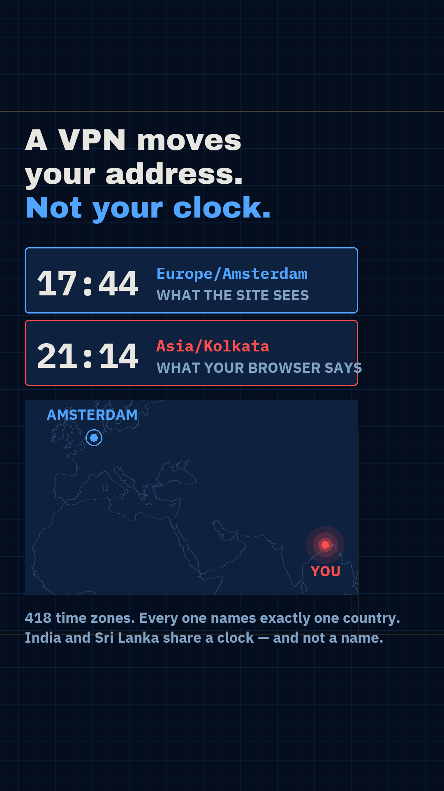

# Gate 0 — `I33`, "A VPN moves your address. Not your clock."

Proposed as **r007**. `I33` is a narrowing of the backlog row "What a VPN hides, and four
things it doesn't" — **four things is a list, and lists are not reels.** This gate covers one
thing.

## 1. The sentence — approved by the human before anything was built

> **"A VPN moves your address to Amsterdam. It doesn't move your clock — your browser still
> says it's 9pm in India, and every site reads that."**

Chosen over two alternatives, both recorded here because the reasons matter:

- *"You changed who's watching, and you paid them"* — sharpest fight, but there is no object
  to draw, only a swap.
- *"38 things it learned before the page finished loading"* — best number, but it is a list
  of text on screen, and that is the shape that has already failed twice.

## 2. The payoff frame

 — `mock_payoff.py`. Two clocks, one screen, disagreeing, over a
map with two pins that cannot both be true. Nothing on it is invented:

- **coastline** — the GSHHG polylines r005 already shipped, read back out of `r005_geo.ts`.
  Same licence path, cleared once already.
- **pins** — the literal coordinates in `zone.tab` for `Europe/Amsterdam` (+5222+00454) and
  `Asia/Kolkata` (+2232+08822).
- **418** — counted from the real IANA database on this machine, printed by the script.

## 3. The three kill conditions

| Condition | Verdict |
|:--|:--|
| **The sentence needs a CS word** | **No.** VPN, address, clock, browser. "IANA", "fingerprint" and "entropy" never have to be said — and "VPN" is not jargon, it is a product advertised at this audience a hundred times a year. |
| **The payoff frame shows an object never seen** | **No.** A clock and a world map. Both nameable by a stranger with the sound off, and the *contradiction between them* is legible before any label is read. |
| **The amazement depends on understanding first** | **No — and this is the one that usually kills them.** The claim being broken has already been installed in the viewer's head by somebody else's advertising budget. The reel does not have to establish "a VPN makes you anonymous" before subverting it. `I52` and `I24` both died here; this one arrives with the setup pre-paid. |

## 4. The reach test — who does the viewer send this to?

**The friend who says "I use a VPN, they can't track me."** They are proving it with one line
that friend runs on their own phone in ten seconds. All three conditions hold:

1. **Witnessed it personally** — every viewer has seen the ad; a large share have used one.
2. **A dispute is already running** — "just use a VPN" versus "a VPN doesn't do that" is one
   of the most repeated arguments in consumer tech.
3. **One repeatable thing** — *it moves your address, not your clock.* Carried into the
   argument without the reel, which is the property r006 never had.

## 5. What is actually computed — and the experiment that could have falsified it

The mechanism claim is "the browser reports the operating system's zone, and the network path
has no influence on it." That is an `X because Y` sentence, so rule 7 requires a test that
could come out the other way. Run on this machine, against the **same V8 + ICU** engine Chrome
uses:

```
  Intl.DateTimeFormat().resolvedOptions().timeZone

  no proxy                          -> Asia/Calcutta
  HTTPS_PROXY + ALL_PROXY set       -> Asia/Calcutta     network changes nothing
  TZ=Europe/Amsterdam               -> Europe/Amsterdam  only the OS moves it
```

And from `/usr/share/zoneinfo`, **tzdb 2026c**:

| | |
|:--|--:|
| Canonical zones | **418** |
| Countries covered | **247** |
| Zones naming more than one country | **0** |

**Every zone name maps to exactly one country.** India and Sri Lanka run the identical
UTC+05:30 clock and are still named apart — `Asia/Kolkata` against `Asia/Colombo`. The string
is more specific than the time it represents.

### The find that only running it produced

**This Mac returns `Asia/Calcutta`, not `Asia/Kolkata`** — ICU still serves the pre-1993 alias,
where Chrome on Android returns the modern name. So the spelling does not just name your
country, **it names your operating system**, and two people in the same room hand over
different strings. That is a candidate beat and it is not on the mock, which shows the common
`Asia/Kolkata`. **Decide which string ships before rendering** — captioning a macOS-only value
as "what your browser says" would be wrong for most of the audience.

## 6. What must NOT be claimed

- **Not "VPNs are useless."** A VPN genuinely does hide your traffic from the local network,
  the coffee-shop wifi and your ISP. It hides your *address* and your *traffic*. It does not
  hide *you*. The reel breaks one specific promise, not the product.
- **Not "every browser leaks this."** Tor Browser reports UTC; Brave randomises; Safari serves
  a reduced fingerprint. The claim is about a default browser, and it has to say so.
- **No VPN company is named.** Nothing is gained by it and it invites a complaint.

## 7. Open items — before the build, not before the gate

1. **The top risk is motion, not truth.** Rule 4 is measured on large-area change: r006's
   route-draw beat scored 16% because a growing line is worth nothing against a 1.0 threshold.
   **Two clock panels and a caption is exactly the shape that scores badly.** This reel needs a
   moving mass — the map travelling from Amsterdam back to India, the zone list of 418 sweeping
   past and collapsing to one — designed in from the first beat, not bolted on after the audit
   comes back at 20%.
2. **Decide `Asia/Calcutta` vs `Asia/Kolkata`** — see §5.
3. **Licence.** tzdb is public domain. GSHHG was cleared for r005. Nothing else is needed and
   no third-party dataset is involved, so there is no r006-style rebuild waiting.
4. **The end beat has to be performable on the phone in the viewer's hand** (rule 9, and r003
   failed it). "Search your own time zone" works; anything needing a console does not.

## 8. The question for the human

The sentence is already approved. This frame exists only to prove the sentence can be shown:

**Sound off, no labels — do the two clocks read as a contradiction, and is that worth 28
seconds?**

Yes → build as r007. No → `I33` is parked with the reason recorded; do not repair it.
