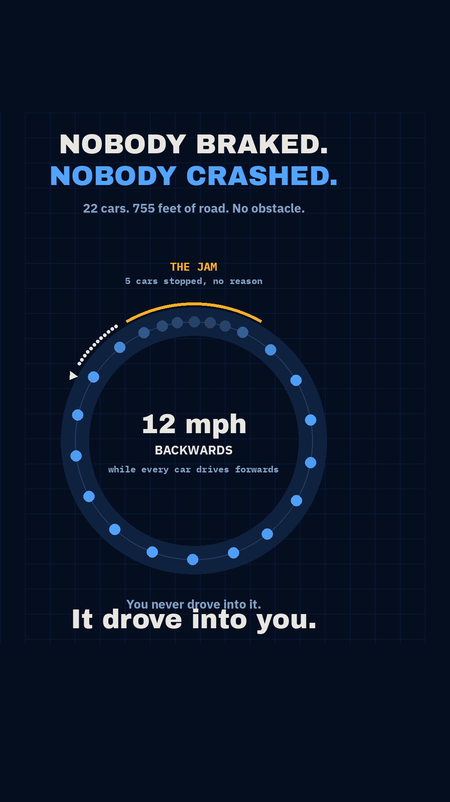

# Gate 0 — `I65`, "a traffic jam with no cause"

Backlog id `I65`, `content_backlog.md` §3 → accent `languages #51A4FF`.
**No reel number is claimed.** `r010` is claimed at Stage 4, if and only if G4 is approved.

Written 2026-09-11, the first concept run under the gate sequence added the same day
(`CLAUDE.md` → SCRIPT FIRST / GATE 3).

## 1. The sentence — G2

> **"You didn't drive into a traffic jam. The jam drove into YOU — it's a wave rolling
> backwards down the highway at about 12 mph, and it was built out of nothing by people
> just following the car in front."**

Not "phantom traffic jams are caused by driver reaction delay". That is the same fact with
the amazement placed after the understanding, which is the third kill condition.

## 2. The payoff frame

 — `payoff_frame.png`, from `mock_payoff.py`.

**Every car on it sits where the real simulation put it** (`../ring.py`, t = 360 s, seed 1).
Nothing is positioned by hand. The amber arc marks the five cars actually below 5 km/h.

## 3. The three kill conditions

| Condition | Verdict |
|:--|:--|
| **The sentence needs a CS word** | **No.** cars, road, jam, backwards, gap. Nothing in the reel has to say "instability", "critical density" or "car-following model". |
| **The payoff frame shows an object never seen** | **No.** Cars on a road, from above. This is the condition that killed `I51` (a 13×13 matrix) and it simply does not bite here. |
| **The amazement depends on understanding first** | **No.** You watch a jam appear on a road where nothing happened. The mechanism is the reward for staying, not the price of entry. |

## 4. GATE 3 — the send test

> **Who does the viewer send this to, and what are they proving?**
>
> **The person in the passenger seat who said "there must have been an accident" — and they
> are proving there wasn't one, and that the jam went through *them*.**

Two channels, which is rare. Only `r005` has ever had one.

| Channel | Does it hold? |
|:--|:--|
| **Argument ammunition** | **Yes.** The dispute is already running, in every car, on every long drive. Everyone has personally witnessed the evidence — crawling, then clear road, then nothing. It resolves to one repeatable thing carried without the reel: *the jam moves backwards at 20 km/h; it drove through you.* |
| **Practical utility** | **Yes.** Leave the gap, don't close it up, don't brake hard. Published: one car in twenty-two dissipates the wave. |
| **High-arousal novelty** | **NO — and this is the honest risk. See §6.** |
| **"This is you"** | Weakly. Sendable to the tailgater in the family. Not load-bearing. |

## 5. Verified claims — primary sources, not recalled

| Claim | Source | Grade |
|:--|:--|:--|
| 22 cars, 230 m circular track, drivers told ~30 km/h and nothing else | Sugiyama et al., *New J. Phys.* **10** (2008) 033001 | **STRONG** — peer-reviewed, the experiment itself |
| A jam forms with no bottleneck of any kind | same | **STRONG** |
| The jam propagates **backwards at about 20 km/h**, the same speed as shockwave jams measured on real roads | same; Sugiyama quoted directly on the 20 km/h figure | **STRONG** |
| Below a critical density it does not happen | same | **STRONG** |
| One car of 22, driven by a controller, dissipates the wave | Stern et al., *Transp. Res. C* **89** (2018) 205–221 | **STRONG** |
| Up to **40% less fuel** and up to **15% more throughput** once the wave is gone | same | **STRONG** |
| 100 instrumented cars on I-24, Nashville, Nov 2022; one smoothing car influences ~20 around it | CIRCLES consortium — **university press release, not a paper** | **MEDIUM — do not put the "20 cars" figure on screen** |

### What we measured ourselves (`ring.py`)

Optimal Velocity model (Bando et al. 1995) on the experiment's geometry. **Three parameters
were calibrated to three measured properties** (30 km/h target, ~40 km/h free-flow escape,
~20 km/h backward wave). Those three are therefore *fitted, not predicted*, and the reel must
attribute them to the experiment, not to us.

**Four things were NOT fitted, and these are what the animation legitimately demonstrates:**

| Result | Measured |
|:--|:--|
| A jam forms from a **10 cm** initial offset, no obstacle | forms at t ≈ 107 s |
| It persists as a localised structure rather than washing out | 5–6 of 22 cars below 5 km/h, indefinitely |
| **Critical density: smooth at ≤20 cars, jams at ≥22** | the experiment jammed at 22 and not below — **this threshold was never fitted and it lands on the experiment's value** |
| One car in 22 on FollowerStopper kills it | speed spread −88% at realistic driver jitter |

**The falsification control is the density sweep.** 8, 12, 14, 16, 17, 18, 20 cars on the same
ring stay perfectly smooth; 22, 26, 30 jam. A model that jammed at every density would be
worthless, and the first version of this script did exactly that — see §7.

### Units — US display, SI physics (decided 2026-09-11)

The reel displays **feet and mph**, and uses US vocabulary (highway, gas, road — not motorway,
petrol, tarmac). Instagram reach is dominated by the US pool and reach is this account's actual
problem, so the localisation is a distribution decision, not a style one.

**Only the display converts. `ring.py` stays SI end to end** — the model, the integration and
every measurement above are metres and m/s, with `mph()`, `feet()` and `inch()` as presentation
helpers. Both sources published in metric, so the metric figures are kept here verbatim and the
conversions are computed, never typed:

| On screen | Source figure | Exact |
|:--|:--|:--|
| 755 feet | 230 m | 754.59 ft |
| 19 mph | ~30 km/h | 18.64 mph |
| 12 mph backwards | ~20 km/h | 12.43 mph |
| four inches | 10 cm | 3.94 in |
| 2 mph crawl | 4 km/h | 2.49 mph |

### Licence

No dataset is used and none is redistributed. The geometry is three published numbers
(230 m, 22 cars, 30 km/h), which are facts and citable — the `r006` distinction between a
published figure and a database. **₹0, no image model, nothing to re-source.**

## 6. The honest risk — and why it is not the `r009` risk

**The phenomenon is saturated.** Checked before writing anything: the backward-travelling wave
is a *standard* feature of phantom-jam explainers, not a niche angle. That is precisely the trap
that killed `r009` — in a saturated genre the response is recognition, not awe.

**So the novelty channel is dead and the reel must not be built on it.** What survives is that
**saturation does not damage argument ammunition.** `r005` is the proof: the curved flight path
is one of the most-covered facts on the internet and it did ~66k, because its value was
usability in a dispute, not novelty. The argument's existence is *why* the topic is saturated.

**And one part genuinely is not saturated:** popular coverage almost universally stops at *"jams
form spontaneously"*. It does not carry the 2018 and 2022 result that **one driver in twenty can
delete the wave**. That is the half that makes it sendable rather than merely watchable, and it
is why the fix is a beat and not a footnote.

**What would make me wrong:** if the viewer already knows the fix. Unverified, and the cheapest
place to find out is Gate 5.

## 7. Negative results, recorded

Both were caught by looking at output, not by the type checker — the repeated lesson.

1. **The ring wraparound bug.** `headways()` used `np.diff` on the position array, which is only
   correct while the array stays sorted. The moment any car wrapped past 230 m it produced one
   huge negative gap and one near-whole-ring gap. **That artefact alone manufactured a "jam" at
   every density tested, including 8 cars with 29 m of space each** — and it printed a tidy
   plausible table while doing it. The density sweep is what exposed it.
2. **Noise that was not noise.** Driver jitter was added per step without the `1/√dt` white-noise
   scaling, so it damped to 0.017 km/h and every seed returned an identical answer. Uncorrected,
   it would have supported "one car restores traffic *perfectly*" — a 100% result that is an
   artefact of a noiseless world. Corrected, the honest figure is **−88% at 1 km/h jitter, and
   only −46% at 2 km/h**: with sloppy enough drivers, one car is *not* enough.

## 8. Assessment

The strongest Gate 3 answer since `r005`, on a subject that is visible by nature and needs no
setup sentence. The risk is genre saturation and it is real, but it lands on the channel the
concept is *not* built on. **The concept is sound; the build should stand or fall on the script.**
