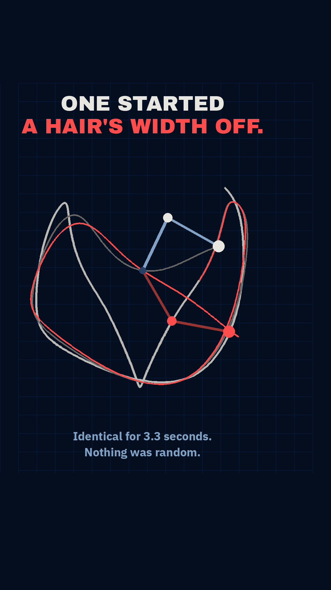

# Gate 0 — `I71`, "the one that started a hair's width away"

Backlog id `I71`, `content_backlog.md` §6 → accent `failure #FF4D4D`. **No reel number claimed.**

**This is a FORMAT experiment first and a topic second.** ~12 s, no narration, two lines of copy,
built to be rewatched rather than understood. Written 2026-09-11 after the r010 verdict:
*"people don't use Instagram to consume that much serious knowledge."*

## 1. The sentence — G2

> **"Two identical pendulums. One started one human hair off. They're the same pendulum for
> three seconds — then they've got nothing to do with each other, and nothing touched them."**

## 2. The payoff frame

 — from `mock_payoff.py`. Both arms and both traces come out of
`../chaos.py`; nothing is drawn by hand. The still carries the whole reel: **one bright path that
becomes two.**

## 3. The three kill conditions

| Condition | Verdict |
|:--|:--|
| **Needs a CS word** | **No.** pendulum, hair, identical, apart. "Chaos", "Lyapunov" and "sensitive dependence" are never said. |
| **An object never seen** | **No.** A swinging pendulum. Nameable with the sound off by anyone. |
| **Amazement depends on understanding first** | **No, and this is the strongest of the three.** One object visibly becomes two. There is nothing to follow. |

## 4. GATE 3 — and this one BENDS the gate. Read this before saying yes.

**The honest answer to "who does the viewer send this to, and what are they proving?" is weak.**
No dispute is running about pendulums. On the channel table it scores like r009: high-arousal
novelty, in a genre that is not unfamiliar — double-pendulum videos exist in quantity. **By the
letter of GATE 3 this should not be built.**

**The argument for building it anyway is that it is a test of a different ranking input.**

| | teaching reels (r006–r010) | this |
|:--|:--|:--|
| runtime | 28–54 s | **12 s** |
| avg watch time | r009 v3: 8 s = **20% of runtime** | target **>100%**, i.e. rewatched |
| travels by | sends | **rewatch** |

A 12 s loop watched twice is 200% watch time. Watch time is a confirmed ranking input, and a loop
wins it *by construction*. That is arithmetic, not taste, and it is the one lever this account has
never pulled: **every reel ever posted has been too long to watch twice by accident.**

**So this is a pre-registered format experiment with its own success metric, and it must be judged
on that metric and not on sends:**

> **Success = average watch time ≥ 100% of runtime. Failure = the account's usual 20–60%.**
> Sends are expected to be ~0 and that does not falsify anything.

**What would make me wrong:** if a 12 s loop pulls the same 20% the 40 s reels pull, then runtime
was never the variable and the problem is the account, not the format. That is worth knowing, and
it costs one reel instead of a strategy.

**Secondary, weak, not load-bearing:** a mild "this is you" channel exists — chaos gets sent with
*"this is why nobody can predict the weather"*. Not relied on.

## 5. Verified, and measured here

All of it is computed in `chaos.py` — classic double-pendulum equations, RK4 at dt = 1/2000 s,
`g = 9.80665 m/s²` (CGPM 1901). **No data source and no licence question: first principles.**

| Quantity | Value | How |
|:--|:--|:--|
| perturbation | **70 µm of arc** = 0.004011° | one human hair, mid of the cited 17–181 µm range |
| pixel-identical until | **3.28 s** | tip separation < 1 px at 190 px/m |
| a viewer could notice | 4.08 s | 4 px |
| unmistakably two | **4.45 s** | 20 px |
| unrelated | **6.16 s** | 150 px |
| apart at 12 s | 362 px | — |
| **energy drift** | **3.5 × 10⁻¹¹ of MgL** | the invariant — if the solver leaked, the "chaos" would be the solver's |

**Why not "a millionth of a degree", which is the better sentence:** because it takes **11.0 s** to
become visible, and a 12 s loop cannot spend 11 s on setup. The full sweep is in `chaos.py`. One
hair is the largest perturbation that is still viscerally tiny and the smallest that fits the
runtime — and unlike a bare angle it is a thing the viewer can picture.

θ₀ = 135°, also chosen from the sweep: 120° pushes the split out to 5.4 s, 144° gives a weaker
final separation (133 px against 362 px).

## 6. Negative results, recorded

1. **The energy check divided by zero.** Drift was normalised by E₀, and at θ₀ = 90° the total
   energy of this system is **exactly zero** — so a clean run reported a drift of `1.0e+05` and
   looked like a broken integrator. A relative error needs a scale that cannot vanish; it is now
   normalised by `M·g·L`.
2. **The payoff frame buried its own sentence.** Painting B's whole trace over A's produced two
   tangles rather than one line that becomes two. The shared path is now drawn once, in bone, and
   red begins only at the split.

## 7. What this format BREAKS, deliberately

Both need a knowing yes, because they are non-negotiables:

- **Non-negotiable 5 (read → animate → hold).** There is no hold and no reading time. The format
  is continuous motion for 12 s.
- **Non-negotiable 9 (end on a reason to follow).** **An end card kills a loop** — it is the frame
  that says "this is over" at exactly the moment the loop should restart invisibly. There is no
  end card.

Non-negotiables 1, 2, 3, 4, 6, 7, 8 are all honoured.

## 8. Sound

**Built silent, as every reel since r003 has been.** For this format sound is likely load-bearing,
and the free, correct route is **trending audio added in the Instagram composer at upload** — which
is also one of Instagram's own listed ranking inputs. That is a posting step, not a build step,
and it keeps the reel at ₹0.

## 9. Assessment

The best payoff frame this account has produced and the weakest GATE 3 answer since r007. Those are
not in tension: **the bet is explicitly that runtime and rewatch, not sends, are the untested
lever.** If it is judged by the send test it fails now, for free, and we should not build it.
