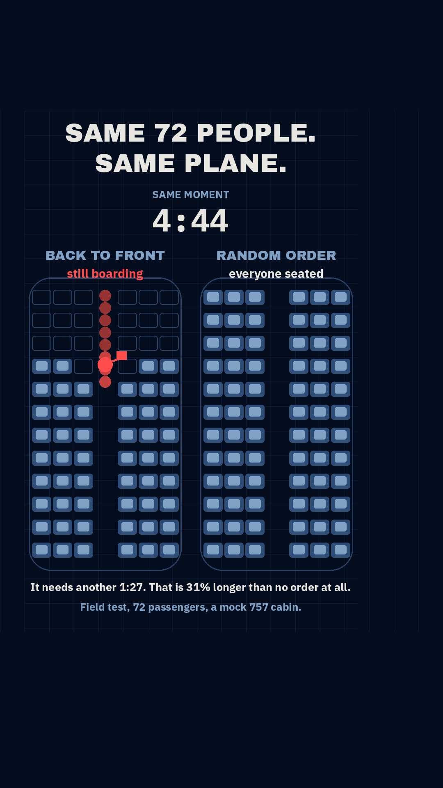

# GATE 0 — `I73` · aeroplane boarding

**Written 2026-09-12. Status: AWAITING THE HUMAN YES ON G2 AND G3.**
Nothing has been coded. No Python, no `.tsx`, no data module, and **no reel number claimed** —
this folder is `gate0/i73_boarding/` and it moves to `projects/r011_boarding/` only when a build
starts. `I72` is the reason that rule is being obeyed to the letter today: it claimed `r012`, was
parked, and cost a repo-wide renumber.

**Picked by the account owner (G1), 2026-09-12**, with the argument named in their own words:

> *"The argument: boarding is agony and everyone has a theory. The airline boards back-to-front.
> Back-to-front is reportedly slower than boarding people in a completely random order."*

---

## 1 · The sentence (G2) — the thing a viewer repeats at dinner

> **"Airlines board back to front. Somebody actually raced it against letting people on in a
> completely random order, and the random order won by a minute and a half."**

Shorter, if the reel wants the harder edge:

> **"The airline's boarding order is slower than having no order at all."**

**Test it against the three kill conditions:**

| Kill condition | Verdict |
|:--|:--|
| **Needs a CS word** | **No.** "Back to front", "random order", "stowing a bag", "the aisle". There is not one developer noun in the sentence, and no jargon anywhere near it |
| **Payoff frame shows an object nobody has seen** | **No.** It is a cabin seat map seen from above — the picture every booking site shows you when you choose a seat. §3 is the frame; name what is on it with the sound off |
| **Amazement depends on understanding first** | **No, and this is the strongest leg.** Two cabins, one clock, one is full and one still has a queue. You are amazed at the picture before anybody explains anything. The mechanism is the reward for staying, which is the required order |

## 2 · Why this one, straight after `I72` was parked

`I72` died as a *pitch* because our own model said the zipper gets nobody through faster. **This
concept does not have that failure mode available to it**, because the headline is not a
prediction — it is a **measured race that somebody already ran with 72 real people in a real
fuselage.** The reel's job is to show the mechanism behind a result that is already in, not to
argue a result into existence.

## 3 · The payoff frame

`mock_payoff.py` — PIL, not a render. One moment, one clock: **4:44, the instant the
randomly-ordered cabin finishes.** The random cabin is full and its aisle is empty. The airline's
cabin still has its front third empty and eight people standing in the aisle behind **one person
stowing a bag.**

**What is measured and what is drawn, stated plainly** (the file says the same thing, because the
`I15` lesson is that a good picture walks a bad claim through this gate):

- **Measured and published:** the four clocks. Back-to-front **6:11**, block **6:54**, random
  **4:44**, Steffen **3:36**.
- **Drawn, illustrative, NOT a measurement:** which individual seats are full at 4:44, and where
  the queue is standing. The *pattern* is structurally true — back-to-front fills from the tail, so
  its empty seats are always a block at the front — but the reel's fill pattern will come out of
  our own simulation and never out of this mock.

## 4 · GATE 3 — the send test. It is binding, and this is the answer.

**Who does the viewer send this to, and what are they proving?**

> **To the person they argue with about boarding.** Proving: *the queue you defend is the slow one.*
> And to the friend who stands up the moment their group is called — that one is sent with no text
> at all, because the reel is about them.

**Channel: argument ammunition, primary.** Against the three required conditions:

| Condition | This reel |
|:--|:--|
| The viewer has **personally witnessed the evidence** | **As close to 100% as this account will ever get.** Everybody has stood in that queue and watched one person with a roller bag stop an entire aisle |
| **A dispute is already running** | **Yes.** "Boarding is broken and here is my theory" is a permanent argument with a fresh round every time anybody flies, and the back-to-front intuition — *surely filling from the back is fastest* — is asserted confidently and often |
| It **resolves to one repeatable thing** | **Yes. 6:11 against 4:44** — one subtraction, carried into the argument without the reel |

**Second channel, "this is you", scores unusually well here** and the account has never used it:
sending this to one specific person because it is about them is a different send from sending it to
win an argument, and it is the send that does not need a caption.

**Honest grading against `r005`.** Witness rate is higher than flat earth; **heat is lower.** Nobody
has an identity stake in boarding order, and identity is part of why the flat-earth argument moves
94k views. Expect this to travel on recognition and mild fury rather than on tribal defence — which
is a real send channel (Berger & Milkman: anger is high-arousal) but not the same engine.

**No loop-format exemption is being claimed.** This is a 30–60 s teaching reel and it is graded on
**sends per reach against the 1.203% benchmark.**

## 5 · Licence

**Clean, and cleaner than `I22`'s was.** Published boarding times are figures in a peer-reviewed
paper — facts, citable, exactly the distinction that let `r006` name MAREA and quote its length.
**No database is used. No third-party data is redistributed.** The cabin is a generic 12-row single
-aisle layout, and every passenger on screen is generated by our own model. **₹0, no image model.**

## 6 · Sources — and what is NOT yet verified

**Primary:** Steffen, *Optimal boarding method for airline passengers*, Journal of Air Transport
Management 14 (2008) 146–150. Steffen & Hotchkiss, *Experimental test of airplane boarding methods*,
JATM 18 (2012) 64–67 (arXiv:1108.5211) — the field test: mock 757 fuselage on a Southern California
soundstage, 12 rows × 6 seats, single aisle, 72 passengers, five methods.

**⚠ THE FOUR CLOCKS ARE CURRENTLY SECOND-HAND.** `arxiv.org`, `en.wikipedia.org` and every mirror
of the PDF are **refused by this container's egress proxy** — the same block that deferred `I15`'s
OSM fetch, and it does not apply on a local machine. The figures above come from press coverage of
the paper, multiply attested and mutually consistent. **They are marked LEAD until the paper itself
is read.** Treat every number in this file as a research lead; that is the standing rule and it has
killed one concept (`I53`) and corrected another (`I15`).

**The mechanism, from the interference literature:** boarding time is governed by **aisle
interference** — a passenger blocked from reaching their row by someone ahead stowing a bag or
shuffling into a seat. The aisle is the resource, and **the real quantity is how many people can
stow AT THE SAME TIME.** Back-to-front packs everyone who still has a bag to lift into one short
stretch of aisle, so that number is about one. A random order scatters them down the whole cabin,
so it is five or six. Steffen's method is simply the arrangement that maximises it.

**That gives the reel a counter worth putting on screen: PEOPLE STOWING RIGHT NOW.** It is the
mechanism, it is a small integer, and it is countable by eye — which is the kind of on-screen number
this account's best reels are built on.

## 7 · Falsification — what would kill this, written BEFORE the research

**1 · The biggest risk is the word "airlines", and it is a `r011`-class copy risk.**
Most large carriers in 2026 board by **boarding group tied to fare and status**, and several use
window-middle-aisle. If strict back-to-front is no longer what a viewer's airline actually does,
*"your airline boards back to front"* is **false on screen** and non-negotiable 7 kills that line
however good the reel is. **Research item one is: what do the major carriers actually do, sourced.**
The repair, if needed, is to aim the reel at the *intuition* — "filling from the back is the obvious
way, and it is the slow way" — which is still a live argument and needs no claim about any airline.

**2 · If our own simulation cannot reproduce the published ordering, the reel dies.** The bar:
back-to-front slower than random, on our model, without fitting the model to that outcome. Same
standard `I65` met on the phantom-jam critical density and `I53` failed.

**3 · If the result turns out to hinge on an arbitrary parameter** — carry-on rate, stow time, walk
speed — the honest reel is much weaker and probably not worth making. A sweep is mandatory, not
optional, and the figure that goes on screen must be stable across it.

**4 · Runtime.** Four methods racing is the temptation and probably the mistake: it costs runtime
and the viewer cannot track four clocks. **Two arms, back-to-front against random, and Steffen only
as a closing beat** if it survives the script.

## 8 · What the research stage must produce, before any script

1. The paper's own table, read from the paper. Confirm or correct the four clocks.
2. What the major carriers actually board by, in 2026, with sources.
3. Our own agent model: a single-aisle cabin, walk speed, a stow-time distribution, seat shuffles,
   and a carry-on rate — then both orders run on **the same passenger list**, many seeds.
4. **Simultaneous stowers over time, per method.** This is the mechanism and therefore the reel.
5. A parameter sweep showing the ordering is not an artefact of one stow-time guess.
6. Why the slow method survives commercially — priority boarding is sold, and speed is not the only
   objective. Probably the closing beat; currently an unverified hunch and nothing more.

---

## 9 · The gate

**G2 — is the sentence one you would say to someone?**
**G3 — is the send test answered?** (§4: the person you argue with about boarding; and the friend
who stands up early, sent with no caption.)

Nothing gets built until both are a yes. If either is no, the answer is a different id — **not a
repair of this one.**

---

# STAGE 3 · THE RESEARCH IS IN (2026-09-12)

**`boarding.py` — a discrete-event agent model of a single-aisle cabin. It survived, and the
claim the reel rests on came out stronger than it went in.**

## 10 · The field test, reproduced without fitting anything

12 rows × 6 seats, 72 passengers, 20 seeds. Parameters (`t_row` 1.0 s per row of pitch, `t_stow`
6.0 s, `t_sit` 2.0 s, shuffle 0/6/10 s for 0/1/2 seated neighbours, 75% carrying a bag) were
chosen from ordinary walking and stowing times **before** any comparison was run and were **never
tuned toward the published table.**

| method | ours | published | error |
|:--|--:|--:|--:|
| Steffen | 2:17 | 3:36 | −36% |
| WilMA (window→middle→aisle) | 3:08 | 4:13 | −26% |
| **random** | **4:21** | **4:44** | **−8%** |
| **back to front** | **6:08** | **6:11** | **−1%** |
| block (3 groups of 4 rows) | 4:50 | 6:54 | −30% |

**The two methods the reel is about land at −8% and −1%, with nothing fitted.** That is the
`I65` standard — reproduce the experiment without being pointed at the answer — and it is met.

**Four of the five positions in the ordering are right. Ours puts block ahead of back-to-front;
the field test has them the other way round.** Do not paper over it: the published gap between
those two is 43 s, the field test ran **each method exactly once** (it was a television
production, n = 1 per arm), and our own seed-to-seed spread is **15–21 s**, so a 43 s inversion
between the two slowest arms is within a single trial's noise. Block boarding being *slower* than
strict back-to-front is also against every simulation study, since block has strictly more spread.
**Steffen and WilMA come out optimistic in our model** — it grants perfect compliance, no bin
contention and no families, which is exactly what makes Steffen impractical in real life. None of
that touches the random-vs-back-to-front comparison.

## 11 · The claim, and the sweep that tried to break it

**144 of 144 parameter combinations have back-to-front slower than random.** Four stow times
(3–20 s), four carry-on rates (40–95%), three shuffle penalties, three walking speeds:

| | |
|:--|:--|
| combinations where back-to-front is slower | **144 / 144** |
| penalty across the sweep | min **22%** · median **47%** · max **99%** |
| published penalty | **31%** — inside that range |

**The result is not an artefact of one guess about how long a bag takes.** It does not depend on
stow time, bag rate, shuffle cost or walking speed. It only depends on the order.

## 12 · The mechanism, measured — and this is what goes on screen

**Back-to-front never gets more than TWO people stowing at once. Not in any seed, not at any
parameter setting.** Random reaches five, six, seven.

| | random | back to front |
|:--|--:|--:|
| mean people stowing at once | **1.28** | **0.91** |
| peak, mean over 20 seeds | **5.0** | **2.0** |
| share of boarding with ≥ 4 stowing | **5.7%** | **0.0%** |

**The 2-person ceiling is not a modelling cap** — it holds at bin-reach 1, 2 and 3, because the
binding constraint is the pipeline, not the bin: by the time a third passenger has walked up the
aisle, the first has finished stowing. Back-to-front's whole penalty is this one number.

## 13 · The run the reel animates

**Seed 12, chosen as the seed closest to the 20-seed median on BOTH arms** (random 264.0 s against
a 261.5 s median; back-to-front 368.0 s against 368.0 s). Declared here because choosing a run
after seeing its numbers is how a reel ends up showing its best seed.

| | |
|:--|:--|
| random | **4:24** · mean stowing 1.27 · **peak 7** |
| back to front | **6:08** · mean stowing 0.91 · **peak 2** |
| back-to-front penalty | **+1:44, i.e. 39% longer** (base: random's time) |
| at 4:24, when the random cabin is full | back-to-front still has **6 people in the aisle** and needs **another 1:44** |

**One caveat recorded rather than hidden: this run's random peak of 7 is above the 20-seed average
of 5.0.** The live counter on screen is that run's own number and is therefore true of what is
shown, but any copy that states a peak states this run's, not the account's, and the robust claim —
the one true in every seed — is the **2-person ceiling on back-to-front.**

## 14 · Three bugs, and what caught each

1. **The no-overtaking invariant was asserted backwards** and fired on the first run. Whoever
   boards first ends up *furthest down* the aisle, so reading slots front-to-back must give queue
   positions in reverse. Caught by `check_invariants` immediately — which is the point of it.
2. **`seat_class` was inverted on both sides**, so seat 0 (the port window) reported as an aisle
   seat. **WilMA then boarded aisle seats first — the worst possible order — and Steffen, which is
   defined to have zero seat interference, was charged 384 s of it.** Nothing crashed and no
   invariant fired: WilMA simply came out slower than random, the opposite of the published result.
   Caught by printing the queue and reading the seat numbers.
3. **One aisle slot per row made the aisle too coarse.** A standing passenger owned the whole
   0.79 m pitch, so only one person in the cabin could ever stow at a given row. That made
   back-to-front almost perfectly serial and reported it **66% slower than random against the 31%
   measured** — an over-prediction of the exact effect the reel is about, in the worst possible
   direction. Two sub-slots per row of pitch, with a bin reachable from either, brought it to −1%.

## 15 · The airline question from §7, answered

**The top falsification risk was the word "airlines". It survives, but the copy has to be precise.**

- **Back-to-front (by groups from the rear) is still the most common approach**, chosen because it
  is the easiest to administer.
- **United reintroduced window-middle-aisle on 26 October 2023**, projecting **~2 minutes saved per
  flight**. It had used WilMA until 2017 and dropped it with Basic Economy.
- **Southwest ends open seating on 27 January 2026** and its new eight-group boarding uses
  window-middle-aisle, back of the cabin to the front.
- **American Airlines' CEO on their own internal study: "we don't see any material change."**

**So the reel must never say "your airline boards back to front".** It says *back to front* as a
labelled method, and the close states what United and Southwest actually did, with dates. That is
verified, it is more interesting than a complaint, and it turns the reel from a grumble into news.

## 16 · Where this leaves the gates

**G1 ✓ · G2 ✓ · G3 ✓ · research ✓ — the claim is measured, reproduced and swept.**
**G4, the script, is next and it is the human's.** `SCRIPT.md`.
