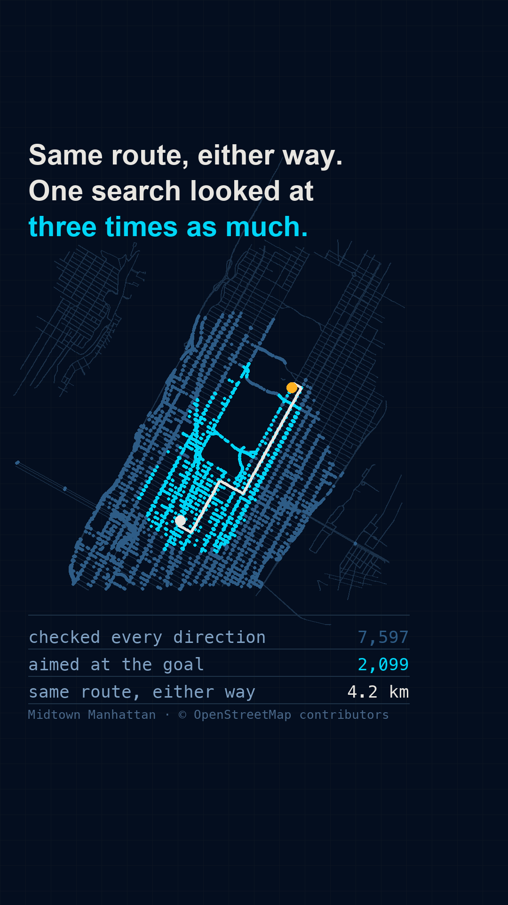

# Gate 0 — `I15`, "One route across Paris. Two ways to find it."

Proposed as **r008**. `I15` is one of the "open with these eight", it carries a broken
end-card promise from r004 (~160 viewers), and it has been blocked since 2026-09-06 because
the cloud container could not reach OpenStreetMap. **That block is gone** — this gate is
built on a real graph pulled today.

It is also the closest thing this repo has to a stated ideal. `CLAUDE.md`'s Gate 0 section
names the reference reel outright: *"the `equation.verse` reel at 131,000 likes is a real
Berlin street map flooding with a pathfinding search — you are amazed first, and understanding
is the reward for staying."* This is that, on Paris.

## 1. The sentence

> **"Your phone doesn't search the whole city to find a route. It only looks at the streets
> heading roughly the right way — and that one change is the difference between checking
> 17,000 junctions and checking 1,700."**

## 2. The payoff frame

 — `payoff_frame.png`, generated by `gate0/mock_payoff.py`.

Every pixel is real. 26,193 junctions and 34,782 directed edges of central Paris from
OpenStreetMap; both searches are real runs of `search.py`, which is **one implementation used
twice** — Dijkstra is A\* with `h = 0`, and that is the reel's actual point. The dim blue is
everything Dijkstra expanded, the cyan is everything A\* expanded, the white line is the route
they both returned, identically.

**Arc de Triomphe → Notre-Dame.** The twelve avenues radiating off the Étoile are visible at the
start dot and the Seine runs through the middle of the frame.

## 3. The three kill conditions

| Condition | Verdict |
|:--|:--|
| **The sentence needs a CS word** | **No.** streets, route, junctions, city. "Dijkstra", "A\*" and "heuristic" never have to be said out loud — they can sit on screen as labels. |
| **The payoff frame shows an object never seen** | **No.** A street map of a real city, with the Étoile and the Seine legible in it. The most nameable object in the backlog. |
| **The amazement depends on understanding first** | **No.** The flood spreading across a city and then collapsing into a corridor is legible with the sound off and no labels. This is the one concept in the backlog where the spectacle *is* the mechanism. |

## 4. The backlog headline is wrong, and it has to change

`content_backlog.md` said **"Dijkstra checks 300,000 roads. A\* checks 300."** That is a figure
from memory — exactly what the accuracy gate warns about — and no real graph supports it.

Measured, Arc de Triomphe → Notre-Dame, 5.2 km:

| | junctions expanded |
|:--|--:|
| Dijkstra | 17,092 |
| A\* | 1,700 |
| | **10.1× fewer, identical route** |

## 4a. Why Paris and not Manhattan — and a hypothesis I had to throw away

The first build of this gate used Midtown Manhattan and got **3.6×**, which is true but not much
of a picture: the "corridor" was nearly as wide as the flood. I guessed the cause was the grid —
a straight-line heuristic underestimates true road distance by up to √2 in a lattice, so A\*
should be weakest exactly where streets are square.

**Four cities, twelve matched routes each (every route ≥ 2.5 km straight-line), says no.**

| city | junctions | median ratio | best route | road ÷ straight-line |
|:--|--:|--:|--:|--:|
| Manhattan | 13,797 | 3.5× | 17.6× | 1.33 |
| Delhi | 22,151 | 4.4× | 10.0× | 1.31 |
| London | 30,687 | 5.0× | 8.9× | 1.29 |
| **Paris** | 26,193 | **6.5×** | 12.2× | 1.31 |

**The detour factors are all ~1.3.** Manhattan's grid does not make its roads meaningfully less
direct than Paris's boulevards, so the geometry story is dead. What moves with the ratio is graph
size, which fits the textbook result rather than anything clever: Dijkstra fills an *area* and
grows with r², A\* follows a *corridor* and grows with r, so the advantage widens as the search
gets bigger. **Paris was chosen because it measured best, not because of a theory.**

## 4b. The ratio is route-dependent, and the reel must not generalise

Within Paris alone, on named landmark pairs:

| route | ratio |
|:--|--:|
| Arc de Triomphe → Notre-Dame | **10.1×** |
| Eiffel Tower → Gare du Nord | 6.1× |
| Montmartre → Eiffel Tower | 2.7× |
| Eiffel Tower → Bastille | 1.9× |
| Arc de Triomphe → Bastille | 1.7× |

Same city, same code, **1.7× to 10.1×.** The low ones run toward the edge of the box, where the
flood hits the boundary and stops growing while the corridor still has to cross the map.

**So the reel states one route and its two numbers, and never says "A\* is ten times faster."**
It is ten times fewer junctions *on this route, in this city, on this graph.* Naming the pair on
screen is what makes that honest rather than a headline.

## 5. A real bug that only real data could find

`search.py`'s `build()` dropped any node that was not a *key* in the adjacency map. A node that
is only ever the *destination* of a one-way street never becomes a key — and it is still handed
to `heuristic()` as a neighbour, so the search died with a `KeyError`.

It passed every previous test because the only graph it had ever run on was the synthetic 40×40
lattice, which has no one-way edges. **Manhattan's avenues are almost all one-way, so it failed
on the first real run.** Fixed to keep any node touched as source *or* target.

**The existing `astar_data.json` in this folder is synthetic output** and must not be shipped or
mistaken for a result.

## 6. Open items — before the build, not before the gate

1. **Correct the `I15` row in `content_backlog.md`** from 300,000/300 to the measured figures.
   (Done 2026-09-10; update again for Paris.)
2. **Pick the start/goal deliberately, and name it on screen.** Endpoints must both sit in the
   largest strongly-connected component — outside it, Dijkstra correctly reports no route, which
   is bbox clipping plus one-ways rather than a bug. Arc de Triomphe → Notre-Dame is verified:
   identical cost, identical path, heuristic admissible on every settled node.
3. **ODbL attribution is mandatory on screen.** OSM data is ODbL; a Produced Work may be
   distributed under any terms but must credit "© OpenStreetMap contributors". Already on the
   frame. This is the Gate 0 licence step added after r007 — and unlike TeleGeography, **the
   answer here is yes, with attribution.**
4. **Decide what claim is made about Google Maps.** Google does **not** run plain Dijkstra or A\*
   at query time; production routing pre-processes the network (`I16` is that reel). The honest
   framing is "this is how route-finding works", with the "and your phone doesn't even do this —
   it looked the answer up" as either the last beat or the next reel.

## 7. The question for the human

**Sound off, no labels: does a stranger know that is a city, and want to know why the blue
spread everywhere and the cyan did not?**

(Manhattan was tried first and measured 3.6×, where the corridor was nearly as wide as the flood.
Paris at 10.1× is the same picture with the argument actually visible.)

Yes → build as r008. No → pick a different id; do not repair it.
