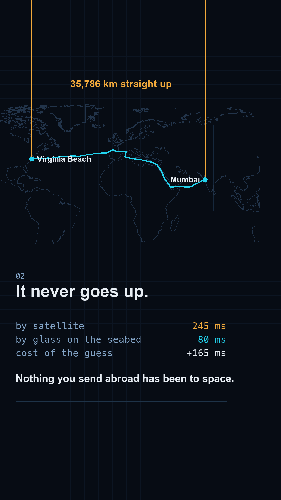

# Gate 0 — `I22`, "Your message to a friend abroad goes underwater"

Proposed as **r007**. This is the reel r006's end card promised to ~9,200 people.
Nothing gets built until a human answers the question at the bottom.

## 1. The sentence

> **"When you message someone in America it doesn't go up to a satellite — it goes
> along a glass cable lying on the ocean floor. And going up would be three times slower."**

Said to a friend at dinner, by someone who does not work in software.

## 2. The payoff frame

 — `payoff_frame.png`, generated by `mock_payoff.py`.

Real geography, not a sketch: GSHHG coastlines reused from r006's generated module,
and a route built from public geography only — real ports and the real chokepoints any
cable between them has to pass through. The numbers on it were computed, not recalled.

## 3. The three kill conditions

| Condition | Verdict |
|:--|:--|
| **The sentence needs a CS word** | **No.** message, satellite, glass, cable, ocean floor. Nothing to translate. |
| **The payoff frame shows an object never seen** | **No.** A world map, two cities, one line. Nameable with the sound off. |
| **Amazement depends on understanding first** | **No.** Two dots leave Mumbai together; one shoots off the top of the frame, one crawls the seabed and arrives first. You watch the answer before you are told it. |

## 4. The numbers

All measured by `mock_payoff.py`. Fibre travels at `c / 1.4675` = **204,288 km/s** —
the group velocity in silica at 1550 nm — so glass is a 32% speed penalty that the
satellite route more than gives back in distance.

| Leg | km | Provenance |
|:--|--:|:--|
| Mumbai → Marseille, via Bab-el-Mandeb and Suez | 9,012 | great-circle chain through public chokepoints; IMEWE runs this trunk and publishes 12,091 km end to end |
| Overland, Marseille → Bilbao | 909 | **assumed** — great circle × 1.35 |
| Bilbao → Virginia Beach | 6,414 | same method; **MAREA's published length is 6,605 km**, so this is 2.9% under |
| **Glass, total** | **16,335** | → **80.0 ms** one way |
| **Geostationary, best case** | **73,444** | → **245.0 ms** one way, at `c` |
| Straight line at `c` (the floor) | 13,003 | → 43.4 ms — nothing can beat this |

**The satellite is 4.5× the distance and 3.1× the time.** The reel resolves to that
ratio rather than to a subtraction, because the ratio is the robust figure — see below.

The satellite figure is deliberately generous: it assumes one geostationary satellite
sitting at each city's own longitude, which is physically impossible for a single
satellite. Mumbai and Ashburn are 150.4° apart and a geostationary satellite's
horizon-to-horizon width is 162.6°, so a one-hop link exists only at ~0° elevation and
is unusable in practice. **A real satellite path is worse than the number on screen.**

## 5. Open items — all four closed, 2026-09-09

**1. The data licence — this one nearly sank the reel, and it is why the numbers above
changed.** The first version of this gate measured the route from
`submarinecablemap.com/api/v3` GeoJSON. TeleGeography's citation policy permits
screenshots of the published maps under CC BY-SA 4.0 but states that **"access to the
underlying databases remains restricted to paying subscribers"** — the route geometry is
not ours to compute from. That version was removed and the still regenerated.

The replacement uses **public geography only**: real ports, and the chokepoints any cable
between them must physically pass — round Arabia, through Bab-el-Mandeb, up the Red Sea,
through Suez, out past Gibraltar, across open Atlantic. It agrees with the licensed
geometry **to 1.4%**, and its two ocean legs cross-check against published cable lengths,
which are facts rather than data: MAREA 6,605 km (this route 6,414), IMEWE 12,091 km end
to end (this route's Mumbai→Marseille trunk 9,012).

**2. The overland leg is an assumption, and it does not matter.** Sweeping the detour
factor across its entire plausible range, and additionally scaling every leg up to
published lengths:

| detour × | land km | total km | fibre ms | payoff ms |
|--:|--:|--:|--:|--:|
| 1.00 | 673 | 15,871 | 77.7 | 167.3 |
| 1.35 | 909 | 16,107 | 78.8 | 166.1 |
| 2.00 | 1,346 | 16,544 | 81.0 | 164.0 |
| 2.00 + scaled to published | 1,346 | 17,082 | 83.6 | 161.4 |

**The payoff moves 167 → 161 ms across the whole range**, and the ratio stays between
2.9× and 3.2×. No assumption available can change the reel's claim, so the reel states
the ratio ("three times") and carries the milliseconds as instrumentation.

**3. Length basis: measured, stated, and deliberately not scaled up.** Scaling to
published lengths would make the cable *slower* and the reel's claim *stronger*, so
leaving it unscaled is the conservative direction.

**4. Latency is a modelled floor and the reel must say so.** These are speed-of-light
times for the route. Real RTT adds switching, queuing, and the fact that traffic does not
take the path you drew. **The reel claims the floor, never the ping** — no on-screen
number is allowed to imply a measured round trip.

## 6. The thing to be honest about

**This does not cleanly test the r006 hypothesis.** r006's success is confounded — it
was a *belief correction* and it was *a map*. I22 is also both, so a good result
reproduces r006 without separating which ingredient did the work. Separating them needs
a belief correction that is not a map, which is a different reel.

That is an argument about what we learn, not about whether to build it: the end card
promised this specific reel to ~9,200 people, and `I15`'s broken promise is the reason
that matters now.

## 7. The question for the human

**Would a stranger, sound off, know what they are looking at — and want to know why the
line goes into the sea?**

Yes → build. No → pick a different id; do not repair this one.
