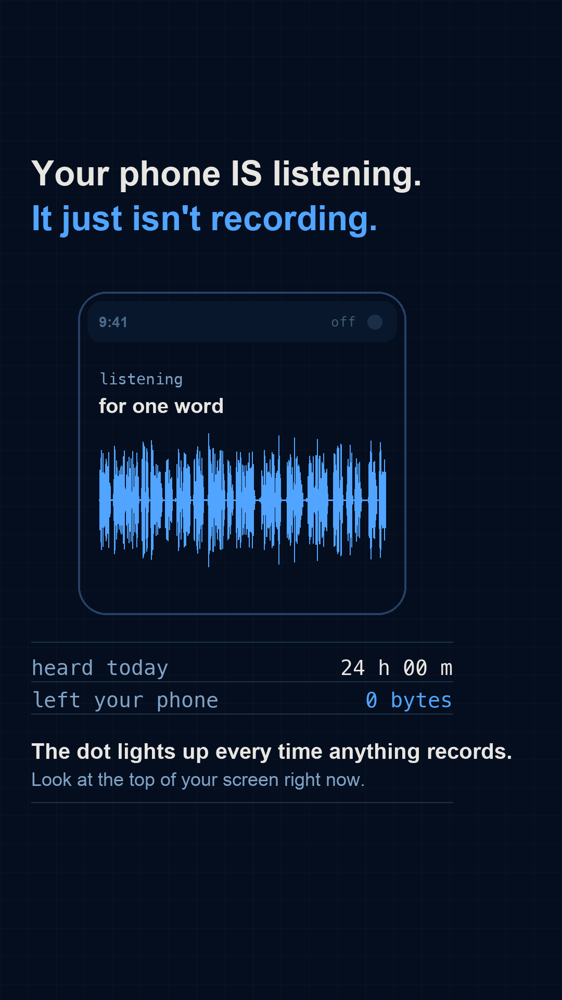

# Gate 0 — `I52`, "Your phone is listening for exactly one word"

Proposed as **r008**. New permanent id, added to `content_backlog.md` §3 on 2026-09-10 — the
first entry chosen under the "live argument" test rather than the falsified belief-correction
one (`brand_guide_software.md` §13).

## 1. The sentence

> **"Your phone IS listening — but only for one word, and the second anything actually
> records you, a dot lights up at the top of your screen. Go and watch for it."**

It concedes the belief before correcting it, which is the point: nobody who is certain their
phone spies on them is moved by "no it doesn't". And it ends in something the other person can
check in ten seconds, on the phone they are holding.

**Who does the viewer send this to, and what are they proving?** The friend who says "I talked
about running shoes and got an ad" — and they are proving it with a dot that person can see for
themselves. That is the question r007 could not answer, and it is why this id was picked.

## 2. The payoff frame

 — `payoff_frame.png`, generated by `mock_payoff.py`.

The waveform is the **real RMS envelope of real speech** — our own narration from
`projects/001_roman_aqueduct`, so there is no licence question and only the envelope is ever
drawn. Sound pours into the phone; the indicator is dark; `left your phone` reads `0 bytes`.

## 3. The three kill conditions

| Condition | Verdict |
|:--|:--|
| **The sentence needs a CS word** | **No.** listening, recording, word, dot, screen. "Wake word" never has to be said. |
| **The payoff frame shows an object never seen** | **No.** A phone and its status bar — the strip a viewer looks at fifty times a day — plus a speech waveform, which r001 already shipped successfully. |
| **The amazement depends on understanding first** | **This is the risk. See below.** |

## 4. The honest problem with this one

**It is a negative claim, and the decisive evidence is platform behaviour rather than a
computation.** Everything else this repo has built runs a real algorithm and shows its output.
Here the proof is "the indicator would be lit and it is not", which is a fact about iOS and
Android, not something Python can derive.

**And the number I expected to carry it does not.** Streaming everything the mic hears at 16 kbps
is 5.2 GB/month — but the average Indian mobile user is already on ~27 GB/month, so always-on
audio is about **19% on top of a normal bill.** That is noticeable, not impossible. A determined
sceptic shrugs at 19%. **So the data-cost argument is supporting evidence and must not be the
payoff.** The payoff is the dot.

**What is genuinely computable, and what the reel would actually run:** a real audio pipeline over
real speech — a rolling buffer overwriting itself frame by frame, with two counters that never
converge (`heard` climbing, `sent` pinned at zero) until a trigger fires and exactly 12 KB leaves.
That is the same shape as r001's fingerprinting: a real signal-processing run, played back.

**My assessment: the frame passes, the mechanism is thinner than r006's.** A stranger can name
what is on screen and will want to know why the counter says zero. But if this fails, it will fail
because the viewer wanted proof and got a platform guarantee.

## 5. Verified claims — both checked against primary sources, not recalled

| Claim | Source |
|:--|:--|
| iOS 14+ shows an **orange** indicator whenever an app uses the microphone (green = camera, or camera and mic) | [Apple Support 108331](https://support.apple.com/en-in/108331) |
| Android 12+ shows a status-bar indicator for mic/camera use; it is **mandatory for all OEMs**; usage is active if system-marked or under five seconds old; **indirect use via `SoundTriggerManager` — i.e. wake-word detection — is attributed to the originating package** | [AOSP privacy indicators](https://source.android.com/docs/core/permissions/privacy-indicators) |

The Android note is the strongest single fact available: the platform explicitly refuses to let
wake-word detection hide behind the assistant.

## 6. Open items — must close before the build

1. **The wake-word buffer needs a real implementation**, not a hand-drawn animation. An open
   detector over a real recording, emitting per-frame buffer state. If that cannot be made to run,
   the reel loses its computable core and should be reconsidered rather than faked.
2. **"Nothing leaves the phone" needs its exceptions stated.** Accidental activations are real and
   documented, and both vendors have run human-review programmes. The claim must be about the
   designed path, not an absolute.
3. **The ad still needs explaining.** The viewer's actual question is "then why did I get that
   ad?" — the answer is data they gave (location, contacts, the other person's search), and the
   reel is not finished until it says so. Otherwise it debunks without replacing.
4. **Licence check on any audio or model used** — the Gate 0 step added after r007. Our own
   narration is already clear; an open wake-word model needs its licence read.

## 7. FAILED — 2026-09-10

**Verdict from the human: "I honestly don't understand the video."**

That is kill condition 3, and it is the answer §4 above was worried about. The frame is a phone
with a waveform and a counter reading zero, and the zero only means anything once you already
accept that a dot would be lit if anything were recording. The amazement depends on
understanding first, which makes it a blog post rather than a reel.

**Not repaired.** `CLAUDE.md` is explicit: any one kill condition ends the concept, pick a
different id. The id stays permanent so this record resolves; the successor is `I15`.

**What the gate cost: one mock and one afternoon of reading, instead of a day of building.**
The failure was visible in §4 before the human saw it — a negative claim whose decisive
evidence is platform behaviour rather than a computation — and writing that down honestly is
what made the verdict quick.

## 8. The original question (unanswered — superseded)

**Sound off: does a stranger know they are looking at a phone listening, and want to know why
"left your phone" says zero?**

And the harder one, given §4: **is a platform guarantee enough of a payoff, or does this need to
be built on something computed?**

Yes → build as r008. No → it fails on kill condition 3; pick a different id, don't repair it.
